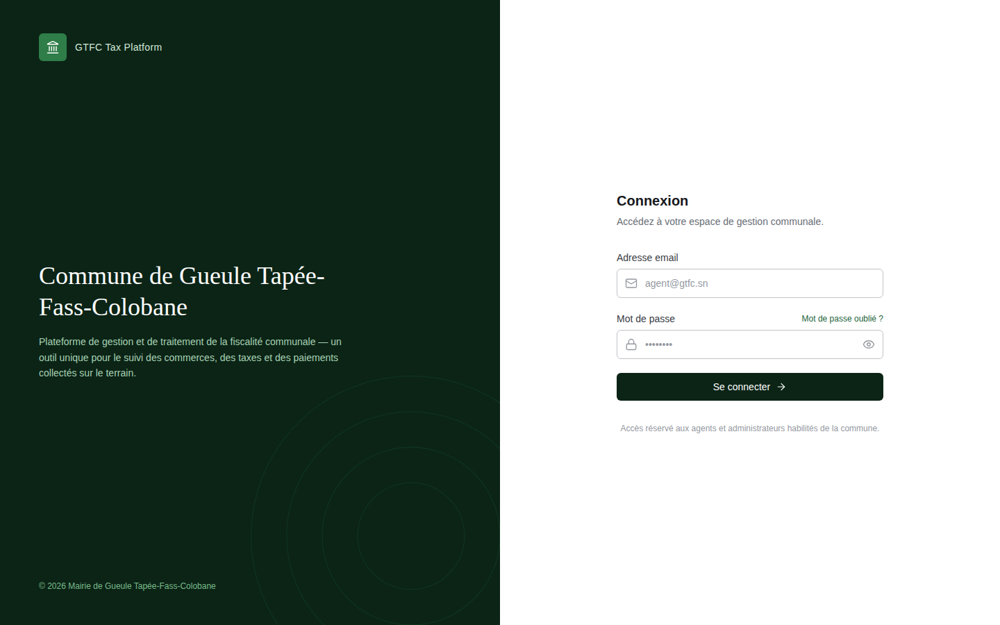
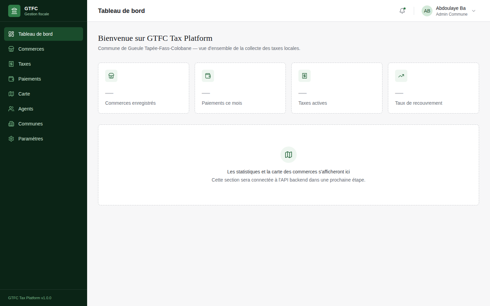
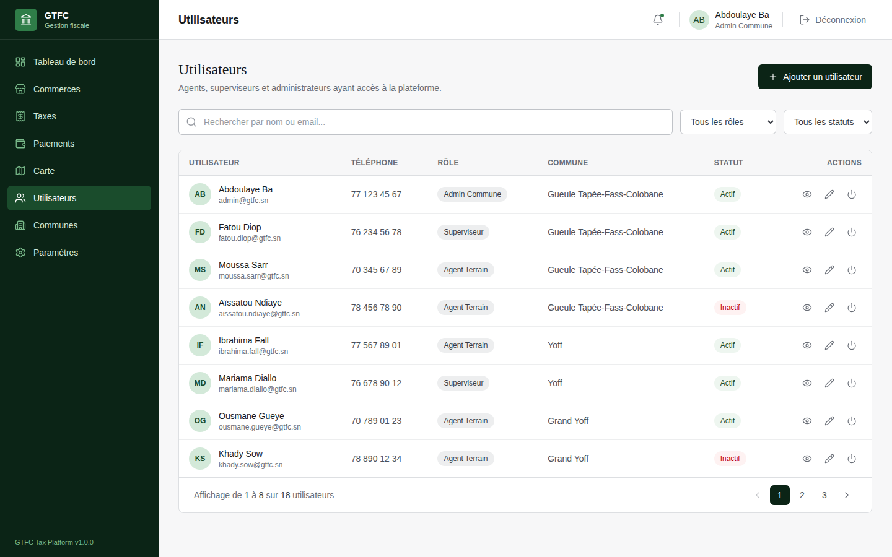
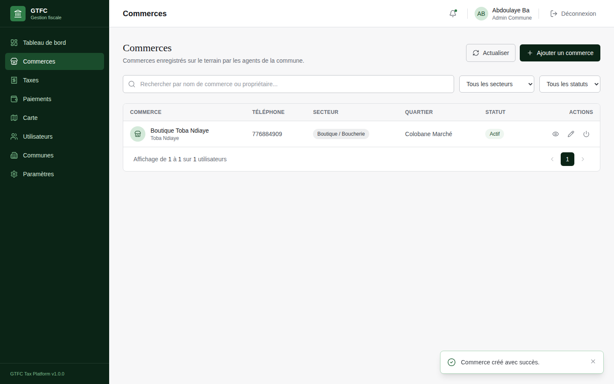
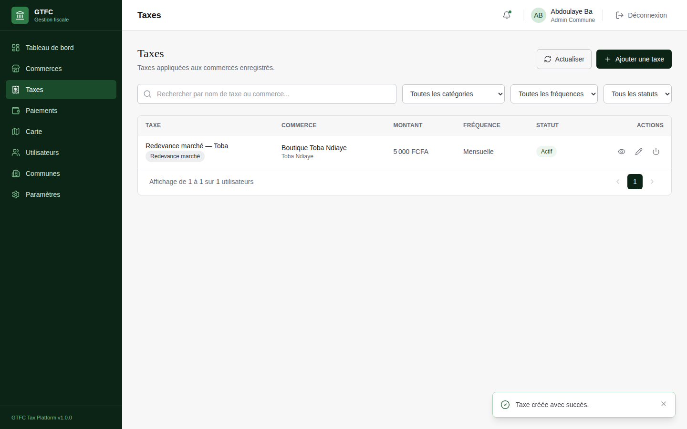
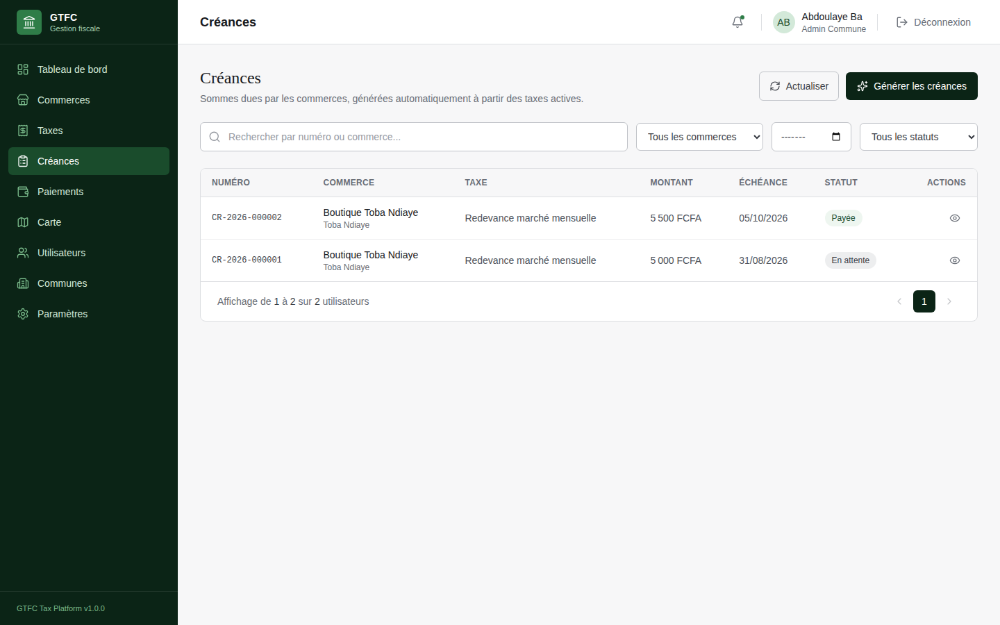

# GTFC Tax Platform

Plateforme de digitalisation de la collecte des taxes locales pour la **Commune de Gueule Tapée–Fass–Colobane** (Dakar, Sénégal).

> Remplace le suivi papier de la fiscalité communale par un outil web centralisé : enregistrement des commerces, définition des taxes, génération automatique des créances, et (à venir) suivi des paiements sur le terrain.

<p align="center">
  
</p>

---

## Sommaire

- [Aperçu](#aperçu)
- [Fonctionnalités](#fonctionnalités)
- [Captures d'écran](#captures-décran)
- [Stack technique](#stack-technique)
- [Architecture](#architecture)
- [Modèle de données](#modèle-de-données)
- [Installation](#installation)
- [Comptes de démonstration](#comptes-de-démonstration)
- [État d'avancement](#état-davancement)
- [Structure du projet](#structure-du-projet)

---

## Aperçu

La commune de Gueule Tapée–Fass–Colobane collecte manuellement les taxes dues par les commerces de son territoire (marchés, boutiques, ateliers...). GTFC Tax Platform digitalise ce processus de bout en bout :

1. Les **agents de terrain** enregistrent les commerces (nom, propriétaire, quartier, secteur d'activité, position GPS).
2. Les **administrateurs** définissent les **taxes** applicables à chaque commerce (montant, fréquence : mensuelle, trimestrielle...).
3. La plateforme **génère automatiquement les créances** dues, période après période, sans doublon possible.
4. *(à venir)* Les paiements sont enregistrés en face de chaque créance, avec suivi en temps réel du taux de recouvrement de la commune.

Le projet est développé de façon incrémentale, un module métier à la fois, chacun testé de bout en bout avant de passer au suivant.

## Fonctionnalités

**Authentification & sécurité**
- Connexion par email / mot de passe, session JWT
- Mots de passe hashés (bcrypt), jamais stockés en clair
- Rôles et permissions (Super Admin, Admin Commune, Superviseur, Agent Terrain)
- Journal d'audit : chaque création/modification/activation est tracée (qui, quoi, quand)

**Gestion des utilisateurs**
- CRUD complet des comptes de la plateforme, recherche, filtres par rôle et statut
- Activation / désactivation (aucune suppression physique d'un compte)

**Gestion des commerces**
- Fiche complète : propriétaire, téléphone, adresse, quartier, commune, secteur d'activité, numéro de registre, NINEA, coordonnées GPS
- Cascade de sélection Commune → Quartier → Secteur d'activité
- Identifiant QR unique généré automatiquement pour chaque commerce (préparation d'un futur contrôle terrain par scan)

**Gestion des taxes**
- Une taxe est rattachée à un commerce précis (montant, fréquence, catégorie, période de validité)
- Catégories de taxes propres à la commune (occupation du domaine public, redevance de marché, publicité...)

**Créances**
- Génération **automatique** des créances dues à partir des taxes actives, période par période
- Numérotation officielle unique (`CR-2026-000001`, incrémentée par année)
- Impossible de générer deux fois la même créance pour la même période (contrainte appliquée au niveau base de données, pas seulement en code)
- Suivi de statut : en attente, partiellement payée, payée, annulée

**Tous les modules partagent** : recherche instantanée, filtres combinables, pagination serveur, notifications de succès/erreur, boîtes de confirmation avant toute action sensible.

## Captures d'écran

| Tableau de bord | Utilisateurs |
|---|---|
|  |  |

| Commerces | Taxes |
|---|---|
|  |  |

| Créances |
|---|
|  |

## Stack technique

**Backend**
- Node.js + Express.js — architecture modulaire (`controller` / `service` / `repository` / `validation` / `routes`)
- PostgreSQL — via [`pg`](https://node-postgres.com/), transactions natives, pas d'ORM
- JWT (authentification) + bcrypt (hashage des mots de passe)
- express-validator (validation des entrées)

**Frontend**
- Next.js 16 (App Router) + React
- Tailwind CSS v4
- Axios (client HTTP centralisé, intercepteur JWT automatique)
- Lucide React (icônes)

**Base de données**
- PostgreSQL, schéma normalisé (3NF), migrations SQL versionnées et idempotentes

## Architecture

Chaque module métier backend suit systématiquement la même séparation des responsabilités :

```
modules/<nom-du-module>/
├── <nom>.routes.js       # définition des endpoints + middlewares (auth, rôle, validation)
├── <nom>.controller.js   # reçoit la requête HTTP, appelle le service, formate la réponse
├── <nom>.service.js      # logique métier (règles, calculs, orchestration)
├── <nom>.repository.js   # seule couche autorisée à écrire du SQL
└── <nom>.validation.js   # règles express-validator
```

La logique métier ne vit **jamais** dans les controllers, et le SQL ne vit **jamais** en dehors des repositories — ce découplage permet de faire évoluer chaque couche indépendamment.

Toute écriture sensible (création, modification, changement de statut) passe par une **transaction PostgreSQL** et génère une entrée dans le **journal d'audit** (`journal_audit`), dans la même transaction que l'opération elle-même.

## Modèle de données

```
communes ──< zones ──< quartiers ──< commerces >── categories_commerces
   │                                     │
   ├──< utilisateurs >── roles           ├──< taxes >── categories_taxes
   │                                     │
   └──< categories_taxes                 └──< creances >── (numérotation CR-AAAA-NNNNNN)
```

- Une **commune** contient des **zones**, qui contiennent des **quartiers**.
- Un **commerce** appartient à un quartier et à une catégorie (secteur d'activité).
- Une **taxe** est rattachée à un commerce précis (pas à un catalogue générique).
- Une **créance** est générée à partir d'une taxe active, pour une période donnée, jamais en double.

Schéma complet et diagramme relationnel détaillé : [`docs/database/conception-base-de-donnees.md`](docs/database/conception-base-de-donnees.md).

## Installation

### Prérequis
- Node.js ≥ 18
- PostgreSQL ≥ 14

### 1. Cloner et installer les dépendances

```bash
git clone <url-du-repo>
cd gtfc-tax-platform

cd backend && npm install
cd ../dashboard && npm install
```

### 2. Configurer les variables d'environnement

```bash
# backend/.env
cp backend/.env.example backend/.env
# renseigner DB_NAME, DB_USER, DB_PASSWORD

# dashboard/.env.local
cp dashboard/.env.local.example dashboard/.env.local
```

### 3. Créer la base de données et appliquer les scripts SQL, dans l'ordre

```bash
psql -U postgres -c "CREATE DATABASE gtfc_tax_platform;"

cd database
psql -U postgres -d gtfc_tax_platform -f schema.sql
psql -U postgres -d gtfc_tax_platform -f creer-admin.sql
psql -U postgres -d gtfc_tax_platform -f migration-commerces-ninea.sql
psql -U postgres -d gtfc_tax_platform -f seed-reference-commerces.sql
psql -U postgres -d gtfc_tax_platform -f migration-taxes.sql
psql -U postgres -d gtfc_tax_platform -f seed-reference-taxes.sql
psql -U postgres -d gtfc_tax_platform -f migration-creances.sql
```

### 4. Démarrer les serveurs

```bash
# Terminal 1
cd backend && npm run dev

# Terminal 2
cd dashboard && npm run dev
```

Le dashboard est accessible sur **http://localhost:3000**, l'API sur **http://localhost:5000/api** (vérification rapide : `GET /api/health`).

## Comptes de démonstration

| Email | Mot de passe | Rôle |
|---|---|---|
| `admin@gtfc.sn` | `GtfcAdmin2026!` | Admin Commune |

## État d'avancement

| Module | Statut |
|---|---|
| Fondation backend (Express + PostgreSQL) | ✅ Terminé |
| Authentification (JWT, sessions, rôles) | ✅ Terminé |
| Utilisateurs | ✅ Terminé |
| Commerces | ✅ Terminé |
| Taxes | ✅ Terminé |
| Créances | ✅ Terminé |
| Paiements | ⏳ À venir |
| Carte des commerces (Leaflet) | ⏳ À venir |
| Rapports PDF / Excel | ⏳ À venir |
| Application mobile (React Native) | ⏳ À venir |
| Intégration Wave (paiement mobile) | ⏳ À venir |

## Structure du projet

```
gtfc-tax-platform/
├── backend/            # API Node.js / Express
│   └── src/
│       ├── config/         # variables d'environnement, connexion PostgreSQL
│       ├── middlewares/     # auth, validation, gestion d'erreurs
│       ├── modules/         # un dossier par domaine métier (voir Architecture)
│       ├── routes/          # agrégation des routes de chaque module
│       └── utils/
├── dashboard/          # Interface web Next.js
│   └── src/
│       ├── app/              # pages (App Router)
│       ├── components/       # composants réutilisables (ui/, layout/, par module)
│       ├── context/           # session utilisateur (AuthContext)
│       ├── lib/                # client Axios centralisé
│       └── services/           # un fichier par module, appels API
├── database/           # schema.sql + migrations + scripts de données de référence
├── docs/                # conception de la base de données, captures d'écran
└── mobile/              # application React Native (pas encore commencée)
```

---

*Projet développé de façon incrémentale — chaque module est fonctionnel et testé avant le suivant.*
